# REC Guard — Architecture & Implementation Report

**Team Exodus · DA-IICT HackOut · Theme: Renewable Energy Intelligence**
**Branch:** `feat/karnav` · **Spec:** `REC_GUARD_BLUEPRINT.md` · **Report date:** 2026-09-12

This document is the complete technical record of the REC Guard build: what was built, how it is
structured, how data flows through it, how it was verified, and where the implementation
deliberately departs from the blueprint. Diagrams are written in Mermaid and render on GitHub;
an ASCII copy of the core pipeline is included for terminals.

---

## Table of contents

1. [Problem and solution in one page](#1-problem-and-solution-in-one-page)
2. [Build log — five phases, five commits](#2-build-log)
3. [System architecture](#3-system-architecture)
4. [Certificate issuance pipeline](#4-certificate-issuance-pipeline)
5. [Three-layer verification pipeline](#5-three-layer-verification-pipeline)
6. [Cryptography design](#6-cryptography-design)
7. [Steganography design](#7-steganography-design)
8. [Ledger data model](#8-ledger-data-model)
9. [Anomaly detection layer](#9-anomaly-detection-layer)
10. [REST API](#10-rest-api)
11. [Frontend architecture](#11-frontend-architecture)
12. [Deployment topology](#12-deployment-topology)
13. [CI pipeline](#13-ci-pipeline)
14. [Testing strategy and results](#14-testing-strategy-and-results)
15. [Security model](#15-security-model)
16. [Deviations from the blueprint and why](#16-deviations-from-the-blueprint-and-why)
17. [Running the system](#17-running-the-system)
18. [Known limitations and roadmap](#18-known-limitations-and-roadmap)
19. [Repository map](#19-repository-map)

---

## 1. Problem and solution in one page

Renewable Energy Certificates (RECs) prove that electricity came from a renewable source. Manual
issuance and tracking lets fraud in through five doors: duplicated certificates, edited energy
values, claims that do not match generation, re-use of already-claimed certificates, and outright
forgeries.

REC Guard closes those doors **by construction** rather than by manual review:

| Fraud type | How REC Guard catches it | Layer |
|---|---|---|
| Energy value edited after issuance (100 → 1000 kWh) | Recomputed SHA-256 no longer matches the hash hidden in the file | 1 |
| Forged document with no hidden proof | No `RECGUARD` payload found in the pixels | 1 |
| Payload rebuilt and re-signed with an attacker's key | RSA-2048 signature does not verify against the issuer's public key | 2 |
| Same certificate ID sold to two buyers | Ledger already shows it claimed, or ledger hash differs from the file's hash | 3 |
| Already-claimed certificate re-submitted | Ledger status is `claimed` | 3 |
| Certificate never issued, or revoked by a regulator | Not in the ledger / status `revoked` | 3 |
| Implausible issuance patterns (bursts, ceilings, duplicates, outliers) | Statistical anomaly layer flags at issuance for regulator review | pre-issuance |

The certificate **carries its own proof**: the signed payload is hidden in the least significant
bits of the certificate image, so any regulator, buyer or auditor can verify a file in seconds
without contacting the issuer. The shared ledger adds the one thing a file cannot prove on its
own: that it was issued exactly once and claimed at most once.

---

## 2. Build log

The blueprint was implemented in five phases. Each phase was verified before it was committed and
pushed to `feat/karnav`.

| # | Commit | Phase | Verification performed |
|---|---|---|---|
| 1 | `d8725d5` | Backend core: config, ledger, crypto, LSB steganography, certificate renderer, anomaly layer | PNG and PDF embed → extract → hash/signature round trips; anomaly rules and Isolation Forest on sample history |
| 2 | `1dc56d9` | Issuer, three-layer verifier, Flask app, auth/issue/verify/ledger/admin routes | Live server; every endpoint exercised with curl including all fraud paths, role checks, path traversal |
| 3 | `6ffe6e2` | Test suite and fixtures | 130 pytest tests, 93 % line coverage |
| 4 | `d2ef8d0` | React frontend | Vite production build; 11 Vitest page tests against a mocked API |
| 5 | `03c8d0f` | Docker, compose (dev + prod), nginx, CI, README, demo seed | Both images built; full stack run and driven end-to-end through the nginx proxy |

```mermaid
gantt
    title Build phases (single session, 2026-09-12)
    dateFormat HH:mm
    axisFormat %H:%M
    section Backend
    Phase 1 core modules        :p1, 13:13, 10m
    Phase 2 issuer/verifier/API :p2, after p1, 6m
    Phase 3 test suite          :p3, after p2, 8m
    section Frontend
    Phase 4 React app + tests   :p4, after p3, 12m
    section Ops
    Phase 5 Docker, CI, docs    :p5, after p4, 10m
```

---

## 3. System architecture

### 3.1 Component view

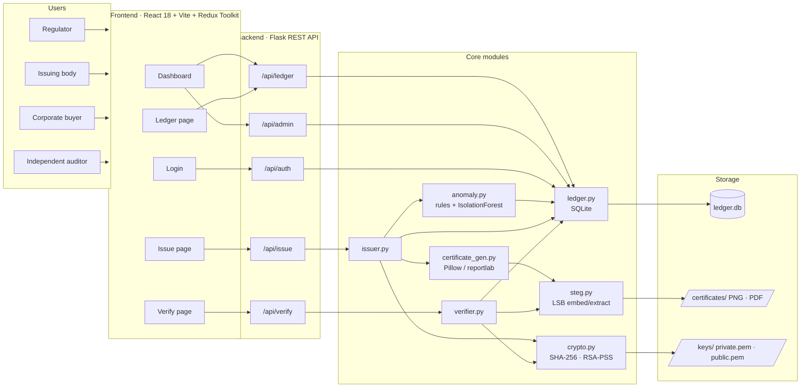

**Reading the diagram:** left to right, users reach the five frontend pages; each page talks to
exactly one API blueprint; the two blueprint modules (`issuer.py`, `verifier.py`) orchestrate the
shared primitives underneath. Note that the issuer touches every primitive while the verifier
touches only `steg`, `crypto` and `ledger`: verification never needs the private key or the
renderer, which is what allows it to be run by anyone.

### 3.2 Responsibilities and trade-offs

| Component | Responsibility | Key decision / trade-off |
|---|---|---|
| `config.py` | Env-driven settings, path resolution relative to `backend/` | Every accessor is a *function*, evaluated at call time, so tests can monkeypatch env vars and the app behaves the same from any working directory |
| `modules/crypto.py` | Canonical payload, SHA-256, RSA-2048 PSS sign/verify, key generation | The signature covers the *stored* hash, so a tamperer must forge both the hash and the signature |
| `modules/steg.py` | LSB embed/extract for PNG and PDF | numpy vector operations instead of per-pixel Python loops: ~55 ms embed / ~12 ms extract on a 1.4 MP image |
| `modules/certificate_gen.py` | Renders the certificate artwork (1400 × 1000 px PNG; reportlab PDF export) | Large canvas gives ~525 KB of LSB capacity versus a ~650 B payload |
| `modules/ledger.py` | All SQLite access: registry, audit log, anomaly log, issuers, users, dashboard aggregates | Audit log has **no** foreign key to the registry so forgeries with unknown IDs are still recorded |
| `modules/anomaly.py` | Pre-issuance screening | Flags and logs, never blocks; production policy is a regulator decision |
| `modules/issuer.py` | Module 1 pipeline | Cleans up the raw artwork and the final file if ledger registration races |
| `modules/verifier.py` | Module 2 pipeline | Keeps evaluating Layer 2 after a Layer 1 failure for diagnostics; skips Layer 3 |
| `routes/*` | Blueprints with JWT (optional on public actions, roles on regulator actions) | Magic-byte sniffing on uploads; `secure_filename` on downloads |
| `frontend/` | SPA with Redux slices for issue / verify / auth | Blueprint design tokens; Vite conventions (`.jsx`, root `index.html`) |

---

## 4. Certificate issuance pipeline

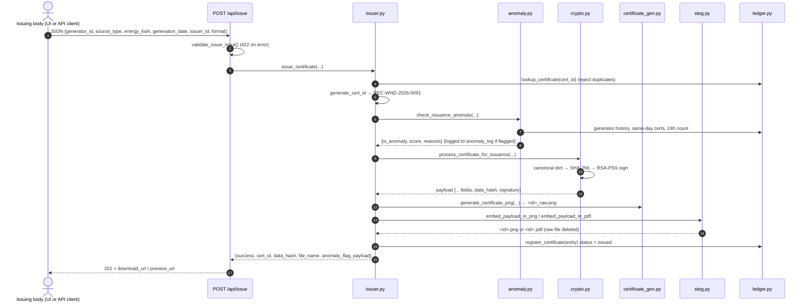

**Why this order:** the anomaly check runs before any file is written so a flagged issuance is
logged even if a later step fails; cryptographic processing runs before rendering so the
`issued_at` timestamp printed on the artwork is the same one that was hashed; registration is the
last step so the ledger never references a file that does not exist.

Certificate IDs follow `REC-{SRC}-{YEAR}-{NNNN}` with source codes
`WND SLR HYD BIO GEO TDL OTH`; the 4-digit suffix is drawn from `secrets` and checked against the
ledger for uniqueness.

---

## 5. Three-layer verification pipeline

### 5.1 Sequence

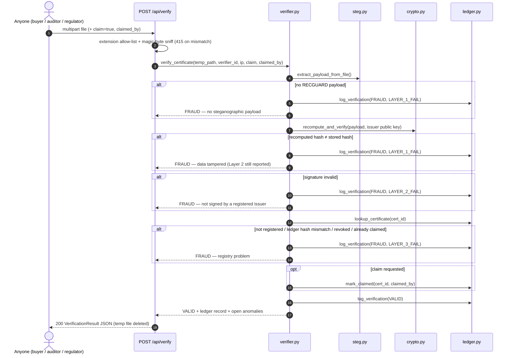

### 5.2 Verdict decision tree

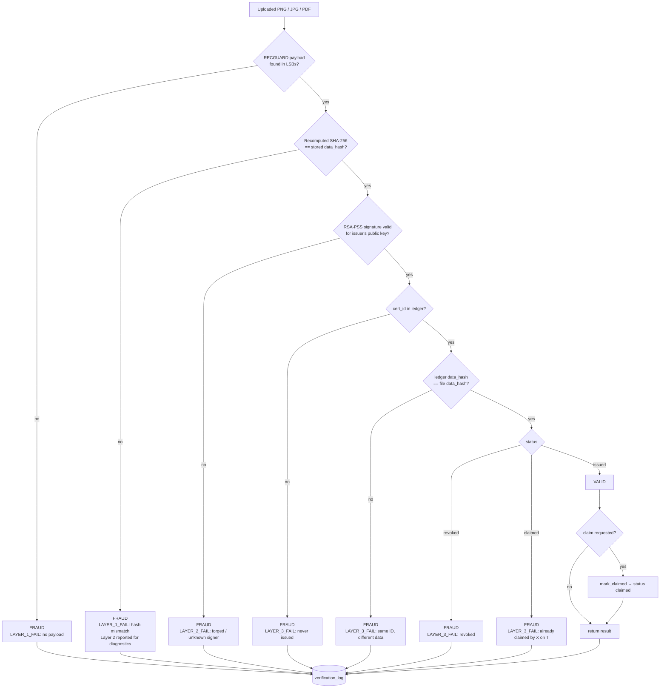

**Reading the tree:** every branch, including the seven failure exits, ends in the audit log;
that is what gives the regulator dashboard its fraud counts. The ledger-hash comparison (`LH`)
is an addition to the blueprint: a certificate can be registered *and* correctly signed yet still
be the wrong document for that ID, which is exactly the "one ID, two buyers" scenario.

### 5.3 ASCII copy for terminals

```
 ISSUE (Module 1)                                  VERIFY (Module 2)
 ┌──────────────┐   hash+sign   ┌──────────────┐   ┌──────────────┐
 │ cert data    │──────────────▶│ signed       │   │ uploaded     │
 │ id·gen·kWh   │               │ payload JSON │   │ PNG / PDF    │
 └──────────────┘               └──────┬───────┘   └──────┬───────┘
                                       │ LSB embed        │ LSB extract
                                       ▼                  ▼
                                ┌──────────────┐   ┌──────────────┐
                                │ certificate  │   │ L1 hash ok?  │──fail──▶ FRAUD
                                │ file (pixels │   │ L2 sig ok?   │──fail──▶ FRAUD
                                │ carry proof) │   │ L3 ledger ok?│──fail──▶ FRAUD
                                └──────┬───────┘   └──────┬───────┘
                                       │ register         │ all pass
                                       ▼                  ▼
                            ┌───────────────────────┐   VALID (+ optional claim)
                            │ SHARED LEDGER (SQLite)│◀── lookup / claim / audit
                            └───────────────────────┘
```

### 5.4 Result shape

```json
{
  "cert_id": "REC-WND-2026-0091",
  "final_result": "VALID",
  "is_valid": true,
  "layers": {
    "layer1_steganographic_integrity": { "passed": true, "detail": "Hash integrity confirmed. …" },
    "layer2_cryptographic_signature":  { "passed": true, "detail": "RSA-2048 signature is valid. …" },
    "layer3_ledger_lookup":            { "passed": true, "detail": "Certificate 'REC-WND-2026-0091' is registered, valid, and not yet claimed. …" }
  },
  "fraud_reason": null,
  "extracted_data": { "...": "full hidden payload" },
  "ledger_record":  { "...": "full ledger row" },
  "uploaded_hash": "recomputed sha256",
  "file_sha256": "sha256 of the uploaded bytes",
  "verified_at": "2026-09-12T08:23:54+00:00",
  "claimed": false,
  "anomalies": []
}
```

---

## 6. Cryptography design

| Step | Detail |
|---|---|
| Canonical payload | Fixed field order: `cert_id, generator_id, source_type, energy_kwh (rounded to 6 dp), generation_date, issuer_id, issued_at` |
| Serialisation | `json.dumps(sort_keys=True, separators=(",", ":"))` — deterministic bytes |
| Hash | SHA-256, hex-encoded (64 chars) |
| Signature | RSA-2048, PSS padding, MGF1(SHA-256), maximum salt length, over the UTF-8 bytes of the hex hash; base64-encoded |
| Key storage | `backend/keys/private.pem` (PKCS8, git-ignored, mode 600) and `public.pem` (SubjectPublicKeyInfo) |
| Multi-issuer | `issuers` table stores each issuing body's public key; the verifier resolves the key by `issuer_id` and falls back to the system key |

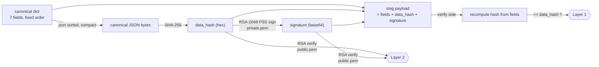

**Why all of hashing, signing, ledger and steganography are needed:** hashing alone proves the
data is unchanged but not who wrote it; signing alone proves the author but not that the
certificate was issued once; the ledger alone can be bypassed by a well-formed forgery; and
steganography alone can be reproduced by anyone who knows the algorithm. Together, the file
carries a proof, that proof is bound to a real issuer, and the issuer's registry confirms
uniqueness and claim status.

---

## 7. Steganography design

### 7.1 Wire format hidden in the pixels

```
 pixel order: row-major, channels R then G then B, 1 bit per channel, MSB first

 ┌────────────────────┬──────────────────────┬───────────────────────────────┐
 │ MAGIC  "RECGUARD"  │ length  uint32 BE    │ payload  JSON (UTF-8, compact) │
 │ 8 bytes = 64 bits  │ 4 bytes = 32 bits    │ length × 8 bits                │
 └────────────────────┴──────────────────────┴───────────────────────────────┘
   → header = 12 bytes = 96 bits = the first 32 pixels
```

| Property | Value |
|---|---|
| Capacity | `(width × height × 3) / 8` bytes − 12; the 1400 × 1000 artwork holds 524 988 B |
| Typical payload | ~646 B (JSON with a 344-char base64 signature) → ~1 750 pixels touched |
| Visual impact | every channel changes by at most 1 out of 255 (verified in tests) |
| Extraction guard | declared length must be > 0 and ≤ 1 MB and must fit in the image, else "no payload" |
| Implementation | `numpy.unpackbits` / `packbits` on the flattened uint8 array |

### 7.2 PNG and PDF paths

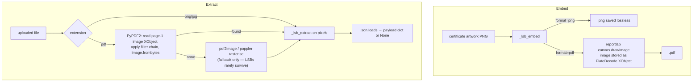

**Why the PDF path had to change:** the blueprint rasterises the PDF page with poppler to
extract the payload. Rasterising resamples pixels and destroys least-significant bits, so no
payload ever came back. Inspection of the generated PDF showed reportlab stores the page image
losslessly (`/Filter [/ASCII85Decode /FlateDecode]`), so extraction now reads that image object
directly. PyPDF2's `page.images` helper silently returns nothing for filter *chains*, hence the
hand-rolled decode via `get_data()`.

---

## 8. Ledger data model

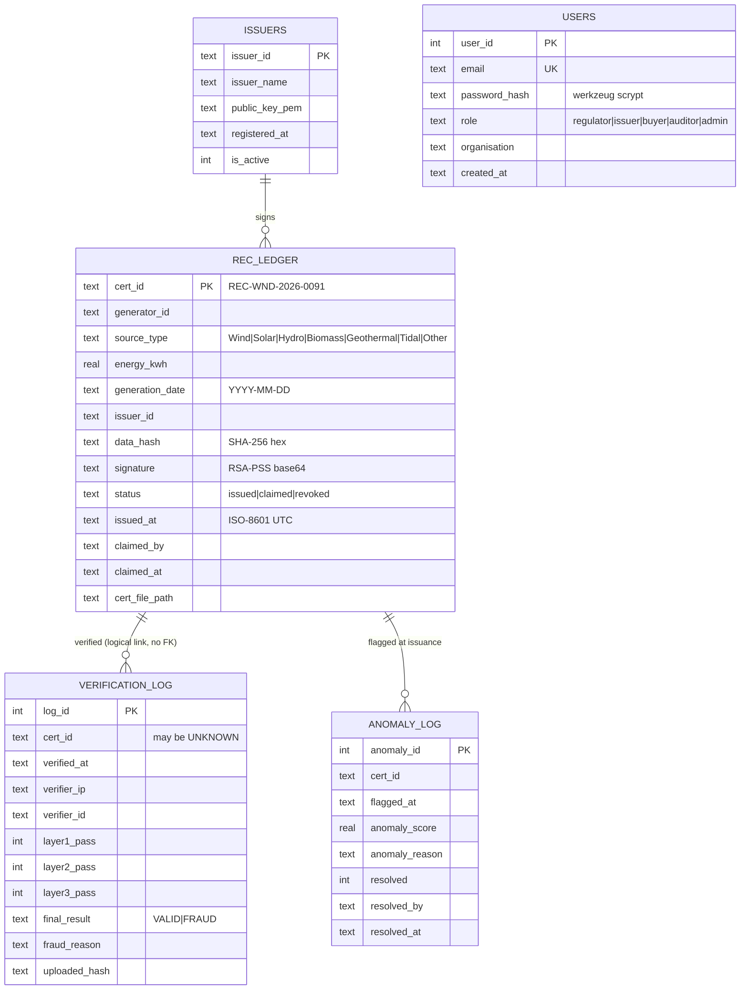

Design notes:

- `status` transitions are one-way: `issued → claimed` (buyer) and `issued|claimed → revoked`
  (regulator). A `CHECK` constraint keeps `claimed_by/claimed_at` null while `issued`.
- The verification log is intentionally not foreign-keyed to the registry. Payload-less
  forgeries have no certificate ID (`UNKNOWN`) and must still appear in the audit trail and in
  the dashboard's fraud counts.
- SQLite runs in WAL mode with `synchronous=NORMAL`; `DATABASE_URL` can be swapped for
  PostgreSQL in phase 2 without changing the module's interface.
- Indexes: generator, status, issued_at, source, (generator, generation_date), and the two log
  tables by `cert_id` / `final_result`.

---

## 9. Anomaly detection layer

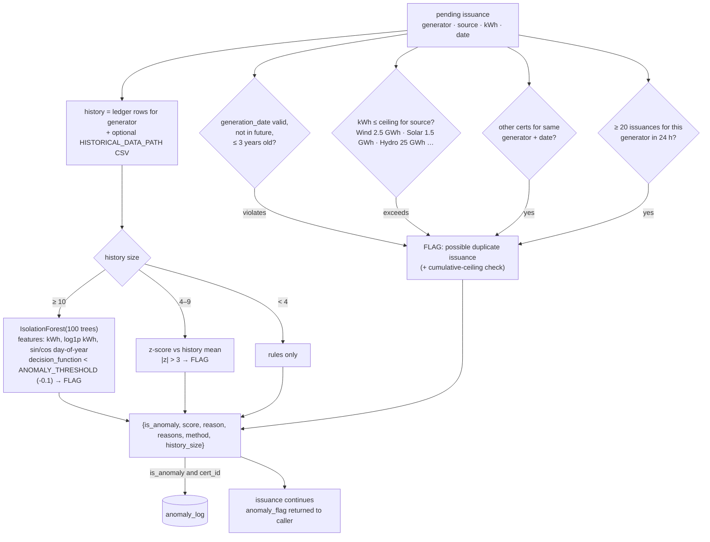

The layer never raises: any internal error yields `is_anomaly: false, method: "error"` so a
monitoring bug can never block a legitimate issuance. Open anomalies are shown on the dashboard
and on any VALID verification result for that certificate; regulators resolve them via
`POST /api/admin/anomalies/<id>/resolve`.

---

## 10. REST API

| Method | Path | Auth | Purpose |
|---|---|---|---|
| GET | `/health`, `/api/health` | – | Liveness |
| POST | `/api/auth/register` | – | Create user (`regulator`, `issuer`, `buyer`, `auditor`) → JWT |
| POST | `/api/auth/login` | – | Email + password → JWT (role claim) |
| GET | `/api/auth/me` | JWT | Current identity |
| POST | `/api/issue` | optional | Issue certificate; `issuer_id` defaults to JWT identity |
| GET | `/api/certificate/<file>` | – | Download (attachment) |
| GET | `/api/certificate/<file>/preview` | – | Inline PNG / PDF for the UI |
| POST | `/api/verify` | optional | Multipart `file`; `claim=true` + `claimed_by` (defaults to JWT identity) |
| GET | `/api/ledger` | – | `status`, `source_type`, `generator_id`, `issuer_id`, `search`, `limit`, `offset`; returns `total` |
| GET | `/api/ledger/stats` | – | Aggregate counters |
| GET | `/api/ledger/<id>` | – | Single record (404 if unknown) |
| GET | `/api/ledger/<id>/history` | – | Record + every verification attempt |
| POST | `/api/ledger/<id>/claim` | JWT | Claim; 400 if already claimed/revoked |
| POST | `/api/ledger/<id>/revoke` | regulator/admin | Revoke |
| GET | `/api/issuers` | – | Registered issuing bodies |
| POST | `/api/issuers` | regulator/admin | Register issuer + PEM public key (validated) |
| GET | `/api/admin/dashboard?days=14` | – | Stats, by-source, fraud-by-layer, daily activity, recent verifications, recent certs, open anomalies |
| GET | `/api/admin/verifications?limit=50` | – | Audit log |
| GET | `/api/admin/anomalies?resolved=false` | – | Anomaly flags |
| POST | `/api/admin/anomalies/<id>/resolve` | regulator/admin | Close an anomaly |

Error envelope: `{"success": false, "error": "...", "details": [...]}` with 400 / 401 / 403 /
404 / 409 / 413 / 415 / 422 as appropriate. Uploads are capped at 16 MB and validated by magic
bytes, so a `.txt` renamed to `.png` is rejected with 415 while a real PNG named `.pdf` is still
verified correctly.

---

## 11. Frontend architecture

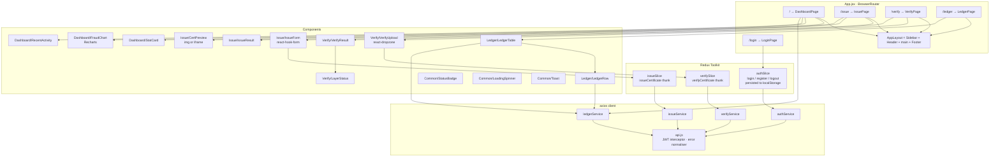

| Concern | Choice |
|---|---|
| Styling | Blueprint design-token system (`App.css`: authority navy, verification green, alert amber); Tailwind configured with the same tokens for layout utilities |
| Auth | JWT stored in `localStorage`; axios request interceptor adds `Authorization: Bearer`; header shows email + role, sign-out clears state |
| Role gating | `selectCanRegulate` hides Resolve / Revoke controls unless role is `regulator` or `admin`; Claim shown to any signed-in user on `issued` rows |
| Previews | PNG via ``, PDF via the browser's native `<iframe>` viewer (react-pdf omitted) |
| Charts | Recharts bar chart (issued / valid / fraud per day) and donut (fraud by layer) |
| Build | Vite 5 with vendor chunk splitting: `vendor-react`, `vendor-charts`, `vendor-ui` |
| Tests | Vitest + jsdom + Testing Library; `AppRoutes` is exported without a router so pages mount inside a `MemoryRouter` with a mocked API |

---

## 12. Deployment topology

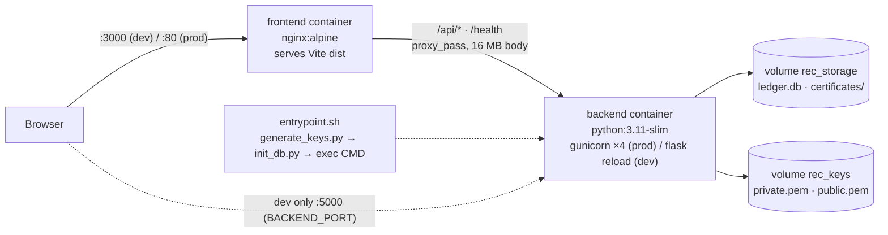

| Artifact | Notes |
|---|---|
| `docker/Dockerfile.backend` | Installs `poppler-utils`, `fonts-dejavu-core`, `libpq-dev`; HEALTHCHECK on `/health`; keys are generated at **container start**, never baked into a layer |
| `docker/Dockerfile.frontend` | Multi-stage: `node:20-alpine` build with `VITE_API_URL=""` (same-origin `/api`) → `nginx:alpine` |
| `docker-compose.yml` | Dev: source bind-mounted for reload, `BACKEND_PORT` / `FRONTEND_PORT` overridable (macOS AirPlay holds 5000) |
| `docker-compose.prod.yml` | gunicorn, `restart: always`, health-gated frontend start, optional root `.env` for secrets |
| Measured | backend image 1.17 GB (scikit-learn / pandas), frontend image 103 MB; full stack issue → download → verify → duplicate-claim through nginx confirmed |

---

## 13. CI pipeline

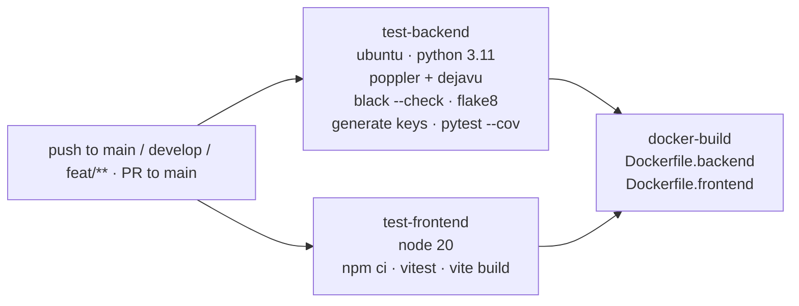

Lint configuration lives in `backend/setup.cfg` (flake8, 120 cols) and `backend/pyproject.toml`
(black, 120 cols) so local and CI runs agree.

---

## 14. Testing strategy and results

| Suite | Scope | Count | Result |
|---|---|---|---|
| `test_crypto.py` | Determinism, PSS round trip, wrong key, garbage signature, missing fields, key generation | 18 | pass |
| `test_steg.py` | Wire format, capacity, truncation, corrupted length/JSON, RGBA/JPEG covers, PNG + PDF round trips, imperceptibility (max Δ = 1) | 16 | pass |
| `test_ledger.py` | Schema, lifecycle transitions, filters/pagination/search, stats + breakdowns, audit/anomaly logs, issuers, users | 14 | pass |
| `test_anomaly.py` | Every rule, z-score path, Isolation Forest path, CSV history, persistence, never-raises | 14 | pass |
| `test_issuer.py` | Success, ledger registration, payload extractability, PDF format, duplicate IDs, 8 invalid inputs, anomaly flag, ID format | 20 | pass |
| `test_verifier.py` | Valid PNG/PDF; blueprint scenarios 1–4; pixel corruption; forged-key and garbage-signature payloads; unregistered, revoked, ledger-hash mismatch; audit trail; registered-issuer key; claim rules | 21 | pass |
| `test_api.py` | Health, auth, issue (validation, PNG/PDF, traversal), verify (valid, claim, tampered, no payload, bad uploads, mislabeled), ledger, claim/revoke roles, issuers, admin dashboard/anomalies | 24 | pass |
| `test_fixtures.py` | Committed fixture PNGs are structurally consistent | 3 | pass |
| **Backend total** | | **130** | **93 % line coverage** |
| `app.smoke.test.jsx` (Vitest) | Every page rendered with a mocked API: dashboard data, issue form submit + validation, verify upload (multipart, claim fields, VALID and FRAUD renders), ledger filters/expand/role gating, login/register/logout, routing | 11 | pass |

Test isolation: a session-scoped RSA key pair in a temp directory, and a fresh SQLite file plus
storage directories per test (`conftest.py`). `HISTORICAL_DATA_PATH` is pointed at a
non-existent file so the anomaly layer only sees what a test puts in the ledger.

Manual/integration verification performed during the build:

- Live API run: register, login, `me`, validation errors, PNG and PDF issuance, duplicate ID,
  anomalous issuance, download, path traversal (404), verify valid, claim, duplicate claim,
  tampered payload, plain image, bad extensions, mislabeled file, ledger listing/search/stats/
  history, claim via ledger route, revoke role check, verify revoked, dashboard, resolve anomaly.
- Docker stack: entrypoint key + DB creation, admin seeding, static UI via nginx, health via
  proxy, PDF issuance, download, verify + claim, duplicate claim → FRAUD, dashboard counters.
- `scripts/seed_demo.py`: baseline VALID plus all four blueprint fraud scenarios, a payload-less
  forgery and an anomalous issuance reproduce the expected verdicts.

---

## 15. Security model

| Control | Implementation |
|---|---|
| Integrity | SHA-256 over a canonical, order-fixed JSON of the seven business fields |
| Authenticity | RSA-2048 PSS signature over the hash; per-issuer public keys in the registry, system key fallback |
| Uniqueness / non-reuse | Ledger primary key on `cert_id`; one-way `issued → claimed → revoked`; ledger hash cross-check |
| Tamper evidence in the file | LSB payload; editing the visible data invalidates the hash; rebuilding the payload invalidates the signature |
| Auditability | Every verification attempt (including unknown IDs) logged with IP, identity, per-layer results and reason |
| Input hardening | JSON validation (422), magic-byte sniffing (415), 16 MB cap (413), `secure_filename` on downloads, temp uploads deleted after use |
| AuthZ | JWT with role claim; regulator/admin required for revoke, issuer registration, anomaly resolution |
| Secrets | Private key git-ignored and mode 600; generated on a Docker volume at first start; `.env` never committed |

Production hardening still required (blueprint Phase 2/3): HSM or KMS-backed keys with annual
rotation, TLS 1.3, encryption at rest for certificate files and the ledger, rate limiting, and
PostgreSQL or a permissioned DLT for concurrent multi-issuer writes.

---

## 16. Deviations from the blueprint and why

| Blueprint said | Implementation does | Reason |
|---|---|---|
| `stegano==0.11.2` in requirements | Removed | Requires Pillow < 10, conflicts with pinned Pillow 10.1; the module was never imported |
| `DB_PATH` / `CERT_STORAGE` computed at import time | `config.py` functions evaluated at call time | The blueprint's own tests monkeypatch env vars per test; import-time constants would share one DB |
| `verification_log.cert_id` FK → `rec_ledger` | No FK | Forgeries with no payload (`UNKNOWN`) must still be audited |
| `embed_payload_in_pdf(pdf_path)` called with a PNG; extract by rasterising | Accepts PNG or PDF cover; extract reads the lossless page image via PyPDF2 | Rasterising destroys LSBs; PyPDF2's `page.images` fails on filter chains |
| Pure-Python per-pixel loops | numpy bit ops | ~100× faster; identical wire format |
| Scenario 3 test adds 128 to a pixel | Real payload edit (500 → 5000 kWh) re-embedded | +128 never changes the low bit, the blueprint test could not fail |
| `test_unregistered_certid` left incomplete | Completed by deleting the ledger row | Exercises the "never issued" branch |
| Layer 3 = registered + not claimed | Also checks ledger hash equality and `revoked` | Catches "same ID, different data" and regulator revocations |
| `verify_routes` trusts the extension | Magic-byte sniff, extension corrected | Renamed files are common in fraud attempts |
| CRA-style `public/index.html`, `App.js` | Vite layout, `.jsx` components, `src/main.jsx` | Vite requires root `index.html` and JSX-typed files |
| `react-pdf` for previews | Native `<iframe>` | Avoids pdf.js worker configuration; browsers render PDFs natively |
| Keys generated in the Docker `RUN` step | Generated by `entrypoint.sh` on a volume | Never bake a private key into an image layer; blueprint's multi-line `RUN python -c` was also not valid Dockerfile syntax |
| `node:18-alpine` | `node:20-alpine` | Node 18 is end-of-life; Vite 5 supports 20 |
| Frontend: build only in CI | Vitest smoke suite added | No browser check was possible from the build session |

Additions beyond the blueprint: `users` table and JWT roles, issuer registry endpoints,
revocation, verification history endpoint, anomaly resolution, dashboard aggregates,
`scripts/seed_demo.py`, `Makefile`, demo fixtures.

---

## 17. Running the system

```bash
# Backend
cd backend
python3.11 -m venv venv && source venv/bin/activate
pip install -r requirements.txt
cp .env.example .env                  # on macOS set FLASK_PORT=5001 (AirPlay holds 5000)
python scripts/generate_keys.py
python scripts/init_db.py
python scripts/seed_demo.py           # optional demo data + *_TAMPERED.png files
python app.py

# Frontend
cd frontend
npm install
cp .env.example .env                  # VITE_API_URL=http://localhost:5000 (or 5001)
npm run dev                           # http://localhost:5173

# Tests
cd backend && pytest tests/ -q --cov=. -p no:logging
cd frontend && npm test

# Docker
docker compose up --build                                 # UI :3000, API :5000
BACKEND_PORT=5001 docker compose up --build               # if 5000 is taken
docker compose -f docker-compose.prod.yml up -d --build   # gunicorn + nginx :80
```

Default admin from `.env.example`: `admin@recguard.io` / `changeme`.

Local environment notes captured during the build: default `python3` is 3.14 (use 3.11 for the
pinned wheels), port 5000 is held by AirPlay Receiver, Docker Desktop must be running before
`docker compose build`, and the Claude-in-Chrome extension does not allow localhost navigation.

---

## 18. Known limitations and roadmap

| Limitation | Impact | Planned fix |
|---|---|---|
| SQLite ledger | Single-writer; fine for MVP, not for many concurrent issuers | PostgreSQL (Phase 2) → Hyperledger Fabric (Phase 3) |
| One system key pair by default | All issuers share a signer unless registered | Multi-tenant keys via `/api/issuers`, HSM/KMS, rotation |
| JPEG uploads | Lossy re-encoding destroys LSBs, so a JPEG copy of a valid PNG verifies as FRAUD (no payload) | Documented; PNG/PDF are the issued formats |
| Anomaly model trained per call | Fine at hackathon scale | Persisted model (`ANOMALY_MODEL_PATH`), scheduled retraining |
| Local file storage | Certificates on disk / Docker volume | S3 / GCS with at-rest encryption |
| UI not yet reviewed in a browser by a human | Layout issues possible | Open http://localhost:5173 after `npm run dev` |

Blueprint roadmap beyond MVP: rate limiting, SCADA / smart-meter feeds, mobile QR verification,
I-REC / TIGR / REGO format support, subscription tiers, public pay-per-verify API.

---

## 19. Repository map

```
.
├── REC_GUARD_BLUEPRINT.md         original specification
├── README.md                      quick start + API summary
├── docs/ARCHITECTURE.md           this report
├── Makefile                       setup / run / test / seed / docker shortcuts
├── docker-compose.yml             dev stack           docker-compose.prod.yml  prod stack
├── docker/                        Dockerfile.backend · Dockerfile.frontend · nginx.conf · entrypoint.sh
├── .github/workflows/ci.yml       lint + tests + builds
├── backend/
│   ├── app.py  config.py  requirements.txt  .env.example  pytest.ini  setup.cfg  pyproject.toml
│   ├── modules/   ledger.py crypto.py steg.py certificate_gen.py anomaly.py issuer.py verifier.py
│   ├── routes/    auth_routes.py issue_routes.py verify_routes.py ledger_routes.py admin_routes.py
│   ├── models/    rec_certificate.py verification_result.py ledger_entry.py
│   ├── utils/     validators.py logger.py file_utils.py response_utils.py auth.py
│   ├── scripts/   generate_keys.py init_db.py seed_demo.py
│   ├── data/historical_gen.csv    sample generator history for the anomaly layer
│   ├── keys/      public.pem (private.pem git-ignored)
│   ├── storage/   certificates/ temp/ ledger.db (git-ignored)
│   └── tests/     conftest.py + 8 test modules + fixtures/ (sample_data.json, 3 PNGs, generator)
└── frontend/
    ├── index.html  vite.config.js  vitest.config.js  tailwind.config.js  package.json
    └── src/  main.jsx App.jsx App.css  components/{Layout,Issue,Verify,Ledger,Dashboard,Common}
              pages/  services/  store/  __tests__/
```
