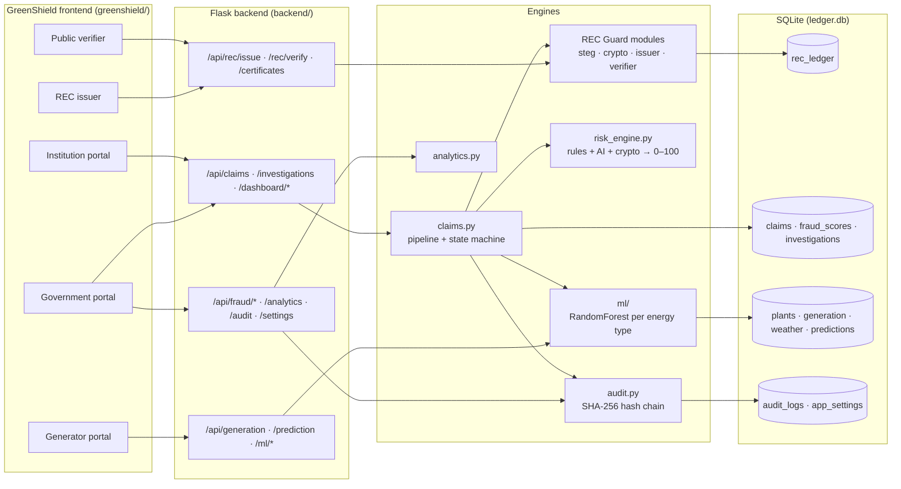
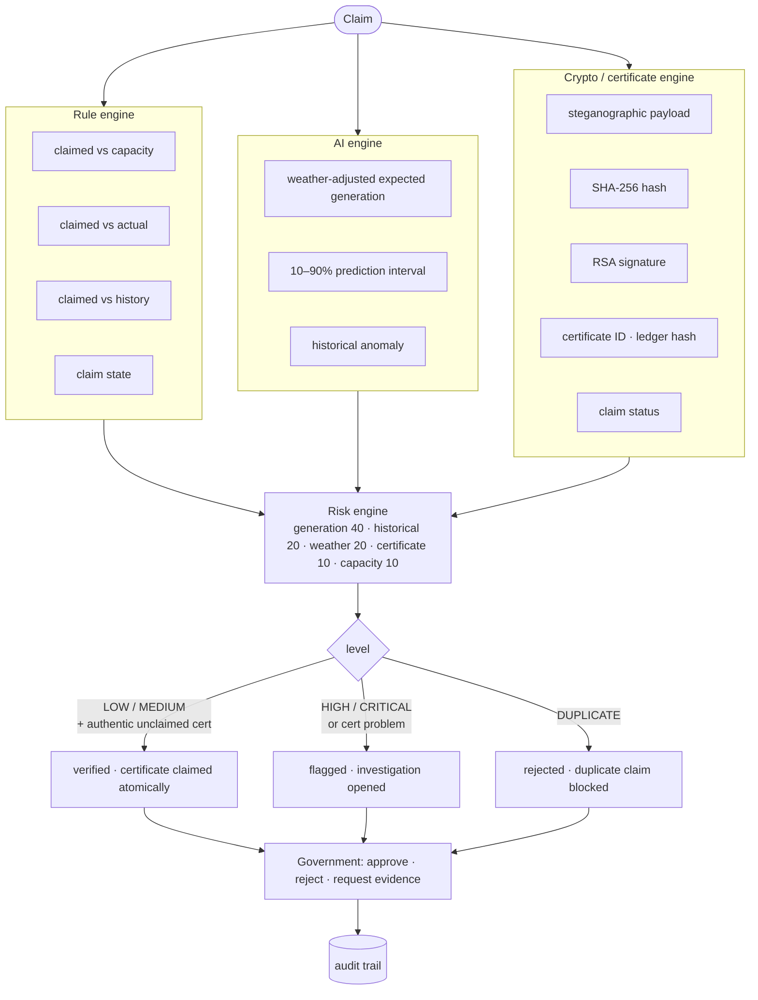
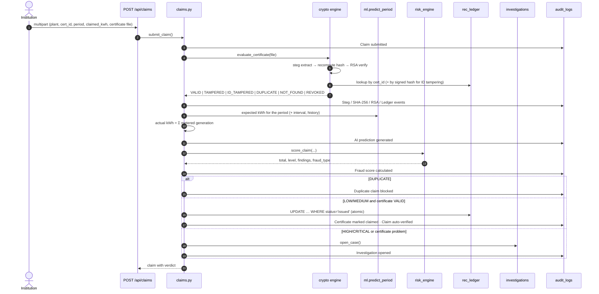
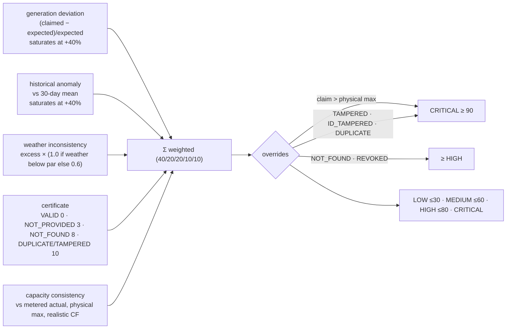
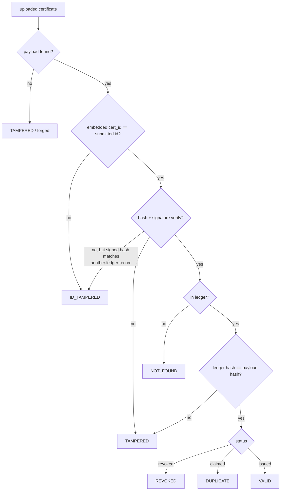
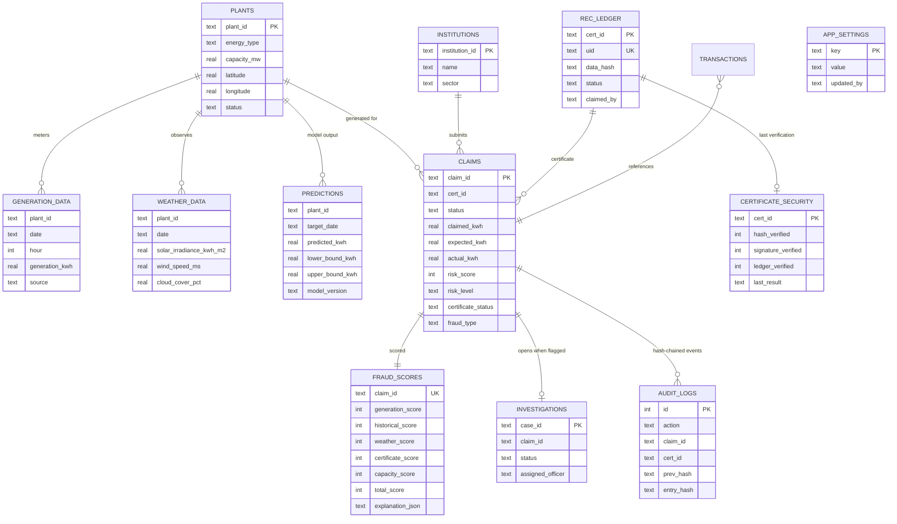
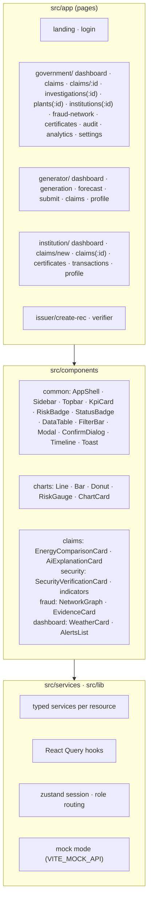
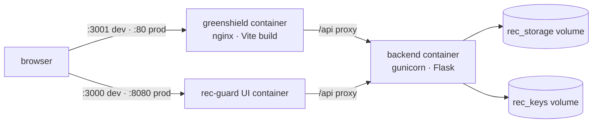

# GreenShield — AI-Powered Renewable Energy Verification & REC Fraud Intelligence

**Architecture & implementation report** · Team Exodus · branch `feat/karnav` · spec: `FinalMD.md`

> Don't trust the claim. Verify it against reality.

GreenShield extends REC Guard (see `docs/ARCHITECTURE.md`) from a certificate-integrity tool
into a government verification platform. It answers three independent questions for every
claim and combines them into one decision:

1. **Did the plant actually generate this much energy?** — weather-driven AI expectation,
   historical output and metered actuals.
2. **Is the REC certificate authentic and untampered?** — steganographic payload, SHA-256,
   RSA-2048 signature, ledger hash.
3. **Has this REC already been claimed?** — immutable certificate identity, claim state, and an
   atomic ledger update that makes double-claiming impossible.

## Contents

1. [Build log](#1-build-log)
2. [System architecture](#2-system-architecture)
3. [Two fraud domains, three engines](#3-two-fraud-domains-three-engines)
4. [Claim verification pipeline](#4-claim-verification-pipeline)
5. [Generation model](#5-generation-model)
6. [Risk engine](#6-risk-engine)
7. [Certificate engine and duplicate prevention](#7-certificate-engine-and-duplicate-prevention)
8. [Data model](#8-data-model)
9. [Tamper-evident audit trail](#9-tamper-evident-audit-trail)
10. [REST API](#10-rest-api)
11. [Frontend](#11-frontend)
12. [Demo data and journeys](#12-demo-data-and-journeys)
13. [Deployment and CI](#13-deployment-and-ci)
14. [Tests](#14-tests)
15. [Running it](#15-running-it)
16. [Deviations from the spec and limitations](#16-deviations-from-the-spec-and-limitations)

---

## 1. Build log

| Phase | Commit | Scope |
|---|---|---|
| 1 | `c23851d` | Domain model, ML generation model, risk engine, claims pipeline, atomic claims, audit chain, seed, 50 tests |
| 2 | `5949d84` | REST API: 66 routes across auth, registry, generation, prediction/ML, claims, certificates, REC issuer/verifier, fraud, investigations, audit, dashboards, analytics |
| 3 | `338e991` | Frontend foundation (Vite + React 18 + TypeScript + Tailwind): design system, 30+ components, typed services, React Query, role-based routing, all pages |
| 4 | `13dd3e8` | Government portal hero screen (three-question verdict, recommendation, generation + weather evidence), dashboard widgets, tests |
| 5 | `0a570f5` | Generator / institution portals, issuer preview, verifier, tests |
| 6 | this commit | Runtime risk settings, demo-journey runner, Docker/compose/CI, documentation |

---

## 2. System architecture



**Reading the diagram:** five portals sit on one Flask API. Every claim goes through
`claims.py`, which fans out to the three engines and writes the audit chain; the REC Guard
modules from the first project provide the real cryptography and steganography rather than a
mock. The ML package has its own package boundary (`modules/ml`) so it can be lifted into a
separate FastAPI service later without touching callers.

---

## 3. Two fraud domains, three engines



Generation-side fraud (over-claiming) is caught by the AI and rule engines; certificate-side
fraud (tampering, forgery, re-use) by the crypto engine. The risk engine keeps the two separable
in the score and the UI, as §53 of the spec requires.

---

## 4. Claim verification pipeline



---

## 5. Generation model

| Aspect | Choice |
|---|---|
| Algorithm | `RandomForestRegressor`, one forest per energy type (Solar / Wind / Hydro / other) |
| Target | Specific yield: kWh per kW of installed capacity per day, scaled back by capacity |
| Features | capacity, energy type, latitude, longitude, month, day-of-year, hour, temperature, humidity, cloud cover, solar irradiance, wind speed, historical yield (30-day mean) |
| Training data | Synthetic, physics-derived, India-seasonal (monsoon cloud/wind), 24 plants × 365 days |
| Interval | 10th/90th percentile across trees |
| Persistence | `models/generation_rf.pkl` via joblib; trained on first use |
| Measured | hold-out R² 0.996, MAPE 3.5%; daily MAPE 1.1% on the seeded 5 MW plant |

**Why per-type forests on a normalised target:** a single forest on absolute kWh split on
capacity first and barely used weather (irradiance importance 0.6%), predicting 24 MWh on a
63%-cloud day for a 5 MW plant. Normalising by capacity and separating technologies moved the
importance to wind speed, humidity and irradiance and cut the seeded plant's monthly error from
+44% to +0.1%.

---

## 6. Risk engine



Thresholds, weights and the auto-verify ceiling are editable at runtime by government users
(`PUT /api/settings/risk`), persisted in `app_settings`, and every change is audited.

---

## 7. Certificate engine and duplicate prevention



Double-claiming is prevented in the database, not the UI:

```sql
UPDATE rec_ledger SET status='claimed', claimed_by=?, claimed_at=?
WHERE cert_id=? AND status='issued'   -- rowcount 1 wins, 0 loses
```

Eight concurrent claimants in `test_atomic_claim_under_concurrency` produce exactly one winner.
`rec_ledger.uid` (UUID4) is the immutable internal identity beside the business key.

---

## 8. Data model



`generation_data.hour = -1` marks whole-day totals (NULL would defeat the UNIQUE constraint);
the API presents it as `null`.

---

## 9. Tamper-evident audit trail

Every event stores `entry_hash = SHA-256(prev_hash ‖ timestamp ‖ actor ‖ action ‖ refs ‖ detail)`.
`GET /api/audit/verify` recomputes the chain; editing or deleting any past row breaks every
hash after it (covered by tests). The government dashboard shows chain health; the audit page
lists `entry ← prev` for each event.

---

## 10. REST API

| Group | Endpoints |
|---|---|
| Auth | `POST /api/auth/login`, `POST /api/auth/demo/{government,generator,institution,issuer}`, `GET /api/auth/me` |
| Registry | `GET/POST /api/plants`, `GET /api/plants/:id`, `POST /api/plants/:id/status`, `GET /api/plants/:id/weather`, `GET/POST /api/institutions`, `GET /api/institutions/:id` |
| Generation | `POST /api/generation`, `POST /api/generation/upload` (CSV), `GET /api/generation/:plantId`, `GET …/template.csv` |
| Prediction / ML | `POST /api/prediction/generation`, `GET /api/prediction/forecast/:plantId`, `GET /api/ml/model`, `POST /api/ml/{predict-generation,anomaly-score,fraud-score}` |
| Claims | `POST/GET /api/claims`, `GET /api/claims/:id`, `GET /api/claims/:id/audit`, `POST /api/claims/:id/decision` |
| Certificates | `GET /api/certificates`, `GET /api/certificates/:id`, `POST /api/certificates/:id/verify`, `POST /api/rec/issue`, `POST /api/rec/verify` (4 steps), `POST /api/rec/revoke/:id` |
| Fraud | `POST /api/fraud/analyze`, `GET /api/fraud/alerts`, `GET /api/fraud/network`, `GET /api/fraud/network/:kind/:id` |
| Investigations | `GET /api/investigations`, `GET /api/investigations/:id`, `POST /api/investigations/:id/decision` |
| Audit | `GET /api/audit`, `GET /api/audit/verify`, `GET /api/audit/:reference` |
| Dashboards | `GET /api/dashboard/{government,me}`, `GET /api/dashboard/generator/:plantId`, `GET /api/dashboard/institution/:id`, `GET /api/analytics/government` |
| Settings | `GET/PUT /api/settings/risk`, `POST /api/settings/risk/reset` |

Roles: `government`/`regulator`/`admin` see everything and decide; `generator` and
`institution` are scoped to their `entity_id`; `issuer` issues RECs; the verifier is public.

---

## 11. Frontend



Design: institutional light palette (teal-navy primary, cool neutrals, saffron accent) with a
dark theme, semantic risk colours kept separate from the accent (§41), Fraunces / Source Sans
3 / JetBrains Mono. The two most important visuals from the spec are dedicated components: the
claimed-vs-expected-vs-actual bars (§42) and the vertical security chain (§43).

---

## 12. Demo data and journeys

`scripts/seed_greenshield.py --reset` creates 12 plants, 12 institutions, 90 days of weather and
metered generation, 28 real certificates, 31 claims run through the real pipeline (22 verified,
7 flagged, 2 rejected), 5 open investigations and a 273-event audit chain. Demo users (password
`Demo@1234`): `gov@greenshield.gov`, `ops@gen-001.in`, `claims@inst-045.org`,
`issuer@greenshield.gov`.

| Spec case | Seeded as | Verdict |
|---|---|---|
| A — inflated energy (890 vs ~360/357 MWh) | `CLM-0001` on `REC-1022`, GEN-001 August | CRITICAL 90, investigation `INV-0001` |
| B — tampered certificate (100 → 1000 kWh) | `CLM-0002`, file `REC-002_TAMPERED.png` | TAMPERED, CRITICAL |
| C — duplicate claim | `CLM-0003` verified, `CLM-0004` on the same `REC-003` | DUPLICATE CLAIM BLOCKED |
| D — certificate ID tampering (REC-004 → REC-999) | `CLM-0005`, file `REC-999_IDTAMPERED.png` | ID_TAMPERED, original REC-004 identified |

`scripts/demo_journeys.py` drives the four journeys of §49–52 against a live API and reports
every check; it creates fresh certificates and claims so the seeded cases stay intact.

---

## 13. Deployment and CI



CI (`.github/workflows/ci.yml`): backend lint + pytest, REC Guard UI tests + build, GreenShield
typecheck + tests + build, then all three Docker images.

---

## 14. Tests

| Suite | Count | Covers |
|---|---|---|
| Backend `pytest` | 200+ | crypto, steg, ledger, anomaly, issuer, verifier, ML, risk engine, audit chain, registry, claims pipeline (all four fraud cases, atomic claims, decisions), GreenShield API (every route, role scoping), runtime settings |
| GreenShield `vitest` | 27 | landing/login/role gating, government dashboard widgets, hero claim verdicts and decisions, lists, generator/institution/issuer/verifier flows, settings editor |
| REC Guard UI `vitest` | 11 | original pages |

---

## 15. Running it

```bash
cd backend && source venv/bin/activate
python scripts/generate_keys.py && python scripts/init_db.py
python scripts/seed_greenshield.py --reset
FLASK_PORT=5001 python app.py                 # macOS: 5000 is AirPlay

cd greenshield && npm install && npm run dev  # http://localhost:5174 (VITE_API_URL=http://localhost:5001)
cd backend && python scripts/demo_journeys.py # optional: end-to-end checks

docker compose up --build                     # GreenShield :3001, REC Guard :3000, API :5000
```

Mock mode without a backend: `VITE_MOCK_API=true npm run dev` (pages show a "Sample data" badge).

---

## 16. Deviations from the spec and limitations

- **Vite instead of Next.js** (§45 lists both); routes mirror the spec exactly.
- **SQLite instead of PostgreSQL** (§35 allows it); the ledger module is the only place to swap.
- **ML in-process, not a separate FastAPI service** (§37): the `modules/ml` package boundary and
  the `/api/ml/*` endpoints are the seam for splitting it out.
- **Certificate ID tampering** is detected two ways: submitted ID ≠ embedded ID, or a failed
  hash whose signed payload matches another ledger record.
- **Runtime settings** live in the process environment plus `app_settings`; with several
  gunicorn workers each process reloads them at start, so restart after changing them in prod.
- Charts, tables and forms are covered by jsdom tests; no human has yet reviewed the rendered
  UI in a browser from this session (the automation extension blocks localhost).
